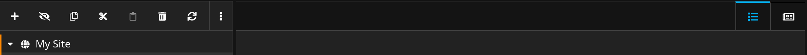

# Kleisli.Neos.DocumentAdminBar
A backend admin bar for Neos CMS to provide backend functions implemented in the document prototype.



## Usage
### Fusion
```
<Kleisli.Neos.DocumentAdminBar:Component.AdminBar>
    <!-- your backend action elements here -->
</Kleisli.Neos.DocumentAdminBar:Component.AdminBar>
```

### Add CSS
```
prototype(MySitePackage.Site:Document.AbstractPage) < prototype(Neos.Neos:Page) {
  head {
    # Add stylesheets to your page
    stylesheets {
      adminbar = afx`<link rel="stylesheet" type="text/css" href={StaticResource.uri('Kleisli.Neos.DocumentAdminBar', 'Public/Styles/AdminBar.css')}/>`
      adminbar.@if.inBacked = ${node.context.inBackend}
    }
    
  }
}
```
Supported css classes:
#### Tabs
Add class `tab` or `tab-active` to a link to display it as Tab.


## Example
See package [Kleisli.Neos.DocumentCollection](https://github.com/Kleisli/Neos.DocumentCollection)

## Todo
- [ ] Add button style
